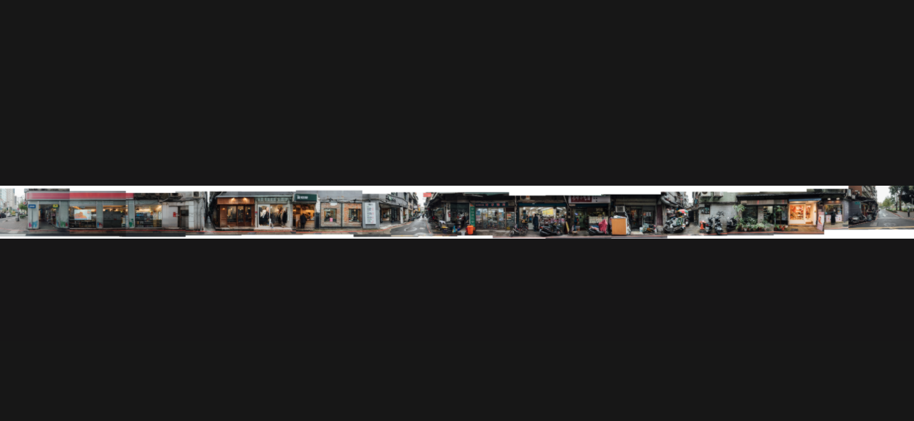
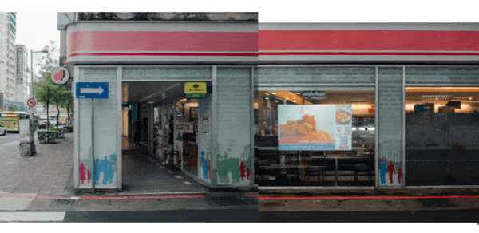
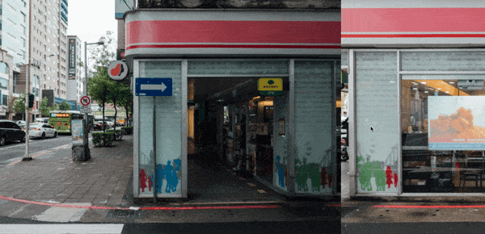
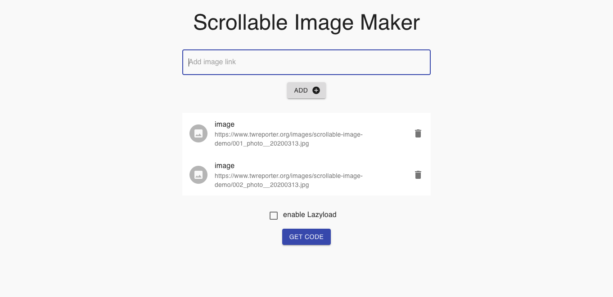
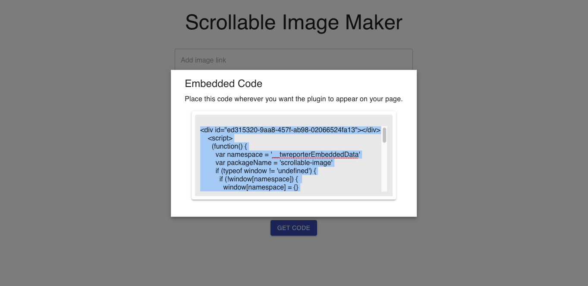
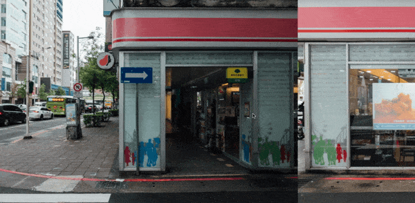

# 不用寫程式也能製作的網頁互動元件：橫著滾吧照片！

## 前言

《報導者》開放實驗室陸續推出有助於網頁製作的小工具，用以快速產生網頁元件，只要透過網頁版的產生器取得程式碼，不需要寫程式也能讓素材在網頁上動起來！

本文要介紹的是 ScrollableImage，會涵蓋使用說明、步驟以及操作範例。

首先，這究竟是什麼呢？

## 這是什麼？

如果你有一張很「長」的照片（也許長寬比 10:1），僅僅橫著置於一個螢幕寬之中無法呈現出照片蘊含的重要細節（如下圖），也不適合擺直的，裁切後又會失去原先照片想傳遞的訊息，這時候就希望有工具能讓照片被橫向閱覽，使用者能透過簡便的操作觀看照片，同時又不影響網頁整體由上而下的滾動方向。



ScrollableImage 就因此而誕生了！

在網頁滾動邏輯不被影響的前提之下，透過使用者滑鼠的滾動或螢幕觸控就能讓照片全螢幕橫向滾動，如此一來照片的比例就不必再受限於螢幕尺寸了。

那麼上面的同一張照片，如果套用 ScrollableImage 來呈現會變成什麼樣子呢？



在桌機上，照片會跟著滑鼠滾輪的滾動、鍵盤的上下鍵一起捲動，而在手機、平板尺寸的行動裝置上，則是跟著一般滑動方向（上下滑）捲動（如下圖），操作上都還算便利。


但是，一次要載入這麼大張的照片，儘管經過壓縮後檔案依然不小，有沒有什麼方法可以加快載入速度呢？

ScrollableImage 支援單張以及多張照片，為了加快載入速度，建議可以將照片裁切後再分開同步載入，ScrollableImage 會顯示多張照片依序組合起來的結果，最後來測試一下：



## 如何使用？

下面會說明如何輕鬆地產生 ScrollableImage 程式碼，以及如何置入網頁內容中:

### 步驟

1. 選擇要載入的圖片，上傳至網路上並取得圖片網址（需有公開存取權限）。

2. 打開 ScrollableImage 程式碼產生器: [ScrollableImage Maker](https://asia-northeast1-cloud-functions-268910.cloudfunctions.net/scrollable-image/)，依序新增圖片網址。

   註：ScrollableImage 預設會在網頁完成讀取後載入所有圖片，如果希望在使用者快要滑到時（距離元件上緣 3 個螢幕高）才去載入圖片，可以選取 `enable lazyload`選項。



3. 點擊 **GET CODE** 按鈕，取得 ScrollableImage 所需的程式碼片段。



4. 複製該程式碼片段，然後貼至目標網頁的 HTML 中你想要顯示的位置。

### 完整 HTML 範例

```html
<html>
  <head>
    <title>網頁標題</title>
    <meta charset="UTF-8" />
    <meta
      name="viewport"
      content="width=device-width, initial-scale=1.0,  user-scalable=no"
    />
    <meta http-equiv="X-UA-Compatible" content="ie=edge" />
  </head>
  <body>
    <!-- 在 body 內貼上 ScrollableImage HTML程式碼片段 -->
    <div id="f6c74ce9-ce65-4927-b539-adf4091c8005"></div>
    <script>
      ;(function() {
        var namespace = '__twreporterEmbeddedData'
        var packageName = 'scrollable-image'
        if (typeof window != 'undefined') {
          if (!window[namespace]) {
            window[namespace] = {}
          }
          if (window[namespace] && !window[namespace][packageName]) {
            window[namespace][packageName] = []
          }
        }
        if (Array.isArray(window[namespace][packageName])) {
          var data = {
            uuid: 'f6c74ce9-ce65-4927-b539-adf4091c8005',
            lazyload: false,
            data: [
              'https:\u002F\u002Fwww.twreporter.org\u002Fimages\u002Fscrollable-image-demo\u002F001_photo__20200313.jpg',
              'https:\u002F\u002Fwww.twreporter.org\u002Fimages\u002Fscrollable-image-demo\u002F002_photo__20200313.jpg',
            ],
          }
          window[namespace][packageName].push(data)
        }
      })()</script
    ><script
      type="text/javascript"
      src="https://unpkg.com/@twreporter/scrollable-image@1.0.0/dist/main-e7b3e42ea2d59f6d2ba8.bundle.js"
    ></script>
  </body>
</html>
```

HTML 範例的測試結果如下所示：



## 常見問題

#### 1. 我可以將圖片上傳到哪裡呢？

可以將圖片上傳到有提供圖片託管服務的網路空間，並取得圖片的公開網址。

下面是幾個推薦用來上傳圖片的平台以及操作指引：

- [Google 雲端硬碟](./google-drive-hosting.md)
- [Dropbox](./dropbox-hosting.md)
- imgur.com

#### 2. ScrollableImage 支援哪些瀏覽器？

我們主要用來開發瀏覽器是 Google Chrome，經過測試，在 Firefox、Safari、Internet Explorer (IE 10 以上，含 IE 10)、Edge 都能夠正常運作。

#### 3. ScrollableImage 是否免費提供商業使用？

是，ScrollableImage 使用 MIT 授權條款，可供商業使用且不需要支付任何費用，詳細資訊請見[授權條款頁](https://github.com/twreporter/orangutan-monorepo/blob/master/LICENSE)。

## 回饋

我們將程式碼公開放置於[Github](https://github.com/twreporter/orangutan-monorepo/tree/master/packages/scrollable-image)，任何回饋或問題回報都歡迎直接在 Github 上開 Issue 或來信至 `developer@twreporter.org` 信箱，我們將有專人為你服務 :kissing_heart:。
